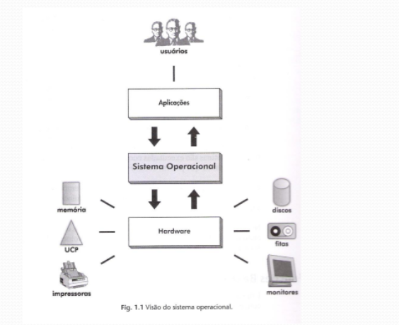
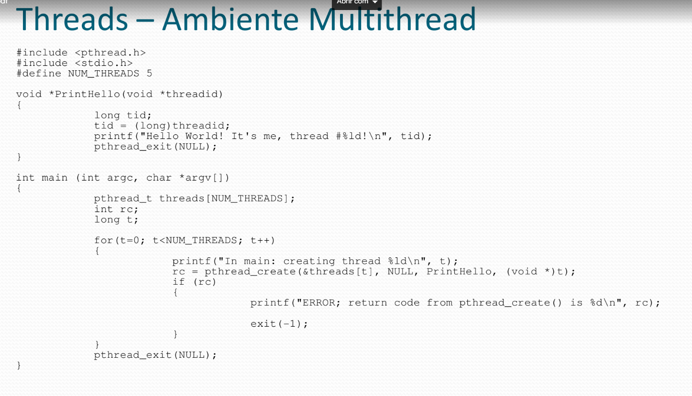

# SO-ate-av1

# Sistemas Operacionais

Ementa

- Introdução
- Conceitos de Hardware e Software
- Estrutura de um SO
- Processos e Threads
- Escalonamento
- Gerência de Memória
- Sistemas de Arquivos
- Gerência de Dispositivos de E/S

Introdução

Colegação organizada de programas de sistema que atua como interface entre computador e usuário, gerenciando os recursos da máquina.

Tipos de Sistemas Operacionais

- Monotarefa
- Multitarefa
- Multiprocessado

- Monotarefa
  - Somente um programa pode ser executado de cada vez
  - Todos os recursos são de exclusividade do programa em execução (tarefa)
  - O processador ficar ocioso durante uma operação de E/S
  - A memória é pouco aproveitada

- Multitarefa
  - Os recursos computacionais são compartilhados entre diversos usuários e aplicações
  - Cabe os SO gerenciar a utilizaçãop dos recursos de forma ordenada e protegida
  - Implementação mais complexa que os sistemas monotarefa
  - Podem ser:
    - Monousuário
    - Multiusuário

- Podem ser:

  - Batch
  - Tempo Compartilhado
  - Tempo Real

- Multitarefa / Batch

  - Os programas são chamados de jobs
  - E/S para disco ou fita
  - Exemplos de jobs:
    - Cálculo numérico
    - Backup

- Multitarefa / Tempo Compartilhado

  - Time-sharing
  - O tempo de execução no processador é dividido em fatias (time-slice)
  - Ao atingir o tempo do time-slice, ocorre **preempção**
  - E/S através de dispositivos mais amigáveis
  - Tempos de resposta mais agradáveis para os usuários
  - Normalmente possuem uma "linguagem" para interagir com o usuário

- Multitarefa / Tempo Real

  - Semelhante aos sistemas de tempo compartilhado
  - Ao invés de time-slices, a execução é orientada a prioridades
  - Presentes em controle de processos
  - Exemplos:
    - Fornos de siderúrgicas
    - Controle de tráfego aéreo

- Multiprocessado

  - Mais de uma UCP trabalhando em conjunto
  - **Escalabilidade**: capacidade de ampliar o poder computacional ao acrescentar mais processadores
  - **Disponibilidade**: capacidade de manter o sistema em operação mesmo em caso de falhas
  - **Balanceamento de carga**: capacidade de distribuir o processamento entre os processadores
  - Podem ser:
    - Fortemente acoplados
    - Fracamente acoplados

- Multiprocessado / Fortemente acoplados

  - Vários processadores compartilham uma única memória física
  - Também são conhecidos como multiprocessadores
  - Podem ser SMP (Symmetric Multiprocessors) ou NUMA (Non-Uniform Memory Acess)
  - SMP: o acesso à memória tem tempo uniforme
  - NUMA: o tempo de acesso à memória pode variar conforme a localização do dado

- Multiprocessado / Fracamente acoplados
  - Dois ou mais sistemas computacionais conectados por linhas de comunicação
  - Cada sistema é autônomo
  - Também são conhecidos como multicomputadores
  - Podem ser SOR (Sistemas Operacionais de Rede) ou sistemas distribuídos
  - SOR: o usuário tem conhecimento dos hosts e seus serviços
  - Sistemas distribuídos: SO esconde os detalhes do sistema.
    - Exemplo: Clusters.

Conceitos de Hardware e Software

Hardware

- Processador
- Memória
- Dispositivos de E/S
- Barramento
- Pipelining
- Arquiteturas RISC e CISC

Sofware

- Compilador
- Interpretador
- Link-editor(Linker)
- Loader
- Depurador (Debugger)

Processador

- Também denominado Unidade Central de Processamento (UCP)
- Controla e executa intruções de máquina
- Composto por:
  - Unidade de Controle (UC)
  - Unidade Lógica e Aritmética (ULA)
  - Banco de registradores
- Sua velocidade é determinada na frequência de um relógio interno (Clock)
- O banco de registradores possui registradores de uso geral e registradores "especiais"
- Contador de Instruções (CI ou PC) - contém o endereço da próxima instrução a ser executada
- Apontador de Pilha (AP ou SP (stack pointer)) - indica o endereço da memória do topo da pilha
- Registrador de status (PSW) - armazena informações sobre o status do processador e sobre a última instrução executada

Memória Principal

- Local onde são armazenados instruções e dados
- É dividida em células de, normalmente, 8 bits
- Cada célula possui um endereço
- O registrador MAR é utilizado para indexar a memória
- Se o MAR possui n bits, a memória possui tamanho 2^n
- Memórias podem ser:
  - RAM
  - ROM
  - EPROM

Memória Cache

- Mais rápida que a memória principal, porém menor
- Se aproveita do Princípio da Localidade
  - A maior parte do tempo de execução de um programa se dá em um trecho pequeno de código
- Atualmente são utilizados mais de um nível de cache. O nível L1 é o mais próximo à UCP

Memória Secundária

- Meio não volátil de armazenamento
- Acesso lento
- Custo baixo
- Maior capacidade

Dispositivos de E/S

- Comunicação entre o sistema computacional e o mundo

- Podem ser:
  - Dispositivos de memória secundária
  - Comunicação homem-máquina

Barramento (Bus)

- Meio compartilhado que permite a comunicação entre as unidades do sistema computacional
- Possui linhas de controle e linha de dados

- Podem ser:
  - Processador-Memória (PCI)
  - E/S (SCSI)
  - Backplane

Pipelining

- "Linha de montagem"
- A execução da instrução é dividida em fases (estágio)

  - Busca da instrução
  - Decodificação da instrução
  - Busca dos dados
  - Execução

- As instruções são executadas em paralelo, porém em estágios diferentes

Arquiteturas RISC e CISC

- A **linguagem de máquina** é a linguagem realmente compreendida pelo processador
- Cada tipo de processador tem o seu conjunto de instruções
- Uma arquitetura RISC (Reduced Instruction Set Computer) é caracterizada por um conjunto simples de instruções, executadas diretamente pelo hardware
- Uma arquitetura CISC (Complex Instruction Set Computer) é caracterizada por um conjunto de instruções que precisam ser interpretadas antes de serem executadas pelo hardware

Tradutor

- Converte o programa fonte em código de máquina
- O módulo gerado é chamado de módulo objeto
- Montador:
  - Converte assembly para linguagem de máquina
- Compilador:
  - Converte linguagem de alto nível para linguagem de máquina

Interpretador

- É um tradutor que não gera módulo objeto
- Realiza a tradução durante a execução do programa
- É utilizado em linguagens interpretadas:
  - Basic, Perl, Python, Java
- Programas interpretados, geralmente, não possuem um bom desempenho
- Linguagens interpretadas são mais flexíveis

Link-editor (Linker)

- Gera, a partir de um ou mais módulos objeto, um programa executável
- Resolve as dependências simbólicas entre os módulos objeto
- Faz a "ligação" com bibliotecas externas
- Realiza a **realocação** das funções e variáveis

Loader

- Carrega do disco para a memória principal um programa a ser executado
- Para isso, precisa "preparar" a memória

Depurador (Debugger)

- Permite que o programador acompanhe a execução do programa para detecção de erros

Estrutura de um S.O.

- Um sistema Operacional é composto por:
  - Utilitários
  - Linguagens de comandos
  - Núcleo (ou Kernel)
    - Conjunto de rotinas que prove às aplicações acesso aos recursos da máquina

Funções do Kernel

- Tratamento de interrupções e exceções
- Criação e eliminação de processos e threads
- Sincronização e comunicação entre processos e threads
- Escalonamento de processos e threads
- Gerência de memória
- Gerência do sistema de arquivos
- Gerência dos dispositivos de E/S
- Auditoria e segurança do sistema

Modo de Acesso

- Os processadores possuem dois modos de operação
  - Modo usuário (normal)
  - Modo kernel (privilegiado)
- No modo usuário, algumas intruções, ditas privilegiadas, não podem ser executadas
- O modo em que o processador está executando é uma das informações presentes no PSW
- Instruções privilegiadas, se não usadas corretamente, podem comprometer a segurança do sistema
- Aplicações só rodam em modo usuário

Rotinas do SO e System Calls

- As rotinas do SO são as funções que compõem o Kernel
- Estas só podem ser executadas em modo kernel
- System Call é o mecanismo através do qual uma aplicação faz uso de uma rotina do SO
- Toda system call retorna o status da sua execução
- System Call é um termo utilizado em sistemas Unix
  - No Windows, é a API do Windows

- Durante a System Call é realizada uma verificação de segurança (proteção por software)
- Se uma aplicação tenta executar uma instrução privilegiada, uma exceção é gerada e a aplicação terminada (proteção por hardware)

- Funções das System Calls
  - 

Linguagens de Comandos

- Permite que o usuário se comunique, de forma simples, com o SO
- Os comandos são interpretados pela shell
- A Shell:
  - Verifica a sintaxe
  - Executa as chamadas ao sistema
  - Exibe os resultados
- Interfaces gráficas fazem o papel da shell
- Pode-se programar na linguagem interpretada pela shell

Boot

- Boot loader (ROM)
- POST (Power On Self Test)
- Busca e execução do boot sector
- Carga da SO propriamente dito
- Execução de arquivos de inicialização do SO

Arquiteturas do Kernel

- Arquitetura Monolítica
- Arquitetura de Camadas
- Máquina Virtual
- Arquitetura Microkernel

Arquitetura Monolítica

- Kernel formado por vários módulos compilados separadamente e linkeditados
- É um grande executável
- A interação entre os módulos é totalmente liberada
- É a arquitetura dos SOs mais primitivos
- Exemplo: MS-DOS

Arquitetura de Camadas

- O SO é dividido em níves sobrepostos
- Cada camada fornece um conjunto de funções que podem ser utilizadas pela camada superior
- As camadas mais internas são mais privilegiadas que as camadas externas
- Facilita a manutenção
- Aumenta a segurança
- Piora o desempenho
- Os sistemas atuais utilizam 2 camadas:
  - Modo usuário
  - Modo Kernel
  - Ex: Unix e Windows

Máquina Virtual

- Existência de um nível intermediário entre o Hardware e o SO
- 
- Cria diversas máquinas virtuais (VM) independentes
- Cada VM tem um "hardware virtual" e um SO diferente
- As VMs são totalmente isoladas
- E o desempenho?
- Se forem distribuídas, aumentam a resiliência
- Exemplo: VMWare ESX
- 

Arquitetura Microkernel

- Os serviços do kernel são realizados por processos
- As aplicações requisitam os serviços direto do processo responsável, numa arquitetura cliente/servidor
- A comunicação é feita através de mensagens
- 
- A gerência das mensagens é realizada pelo kernel
- O kernel gerencia:
  - A troca de mensagens entre clientes e servidores
  - Gerência de memória básica
  - Gerência de processos básica
  - E/S de baixo nível
- Os servidores executam em modo usuário
- Não importa se o sistema é:
  - monoprocessado
  - multiprocessado fortamente acoplado ou
  - mutiprocessado fracamente acoplado
- O número de servidores é escalável
- Implementação extremamente difícil!

Processos e Threads

- Processos
- Threads
- Sincronização e Comunicação entre processos

Processos

- Processo é um programa em execução
- Para que os processos possam existir em sistemas multiprogramáveis, é necessário armazenar informações que permitam a manipulação dos processos
- Então, **Processo é o conjunto de informações para que o SO implemente a concorrência entre programas e suas corretas execuções**
- A troca do processo que está sendo executado no processador por outro é denominada **troca de contexto**
- O contexto de um processo abrande:
  - Contexto de hardware
  - Contexto de software
  - Espaço de endereçamento

Processos - Contexto de hardware

- Contém os valores dos registradores:
  - Registradores gerais
  - PC
  - SP
  - PSW
- Quando o processo está em execução, esses valores estão no hardware
- Quando o processo é substituído, os valores são copiados para uma estrutura interna do SO
  

Processos - Contexto de Software

- É composto pelos limites e características dos recursos que podem ser alocados pelo processo

- Pode ser dividio em:
  - Identificação
  - Quotas
  - Privilégios
- Identificação
  - PID
    - Número inteiro que representa uma identificação única do processo no sistema
  - UID
    - Número inteiro que representa a identificação do usuário "dono" do processo
    - Utilizado para implementar segurança
- Quotas
  - Limites de cada recurso que o processo pode alocar
  - Ex:
    - Número máximo de arquivos abertos simultaneamente
    - Tamanhp máximo de memória
    - Tamanho máximo do buffer de E/S
    - Número máximo de processos filhos
- Privilégios
  - Definem que ações são permitidas ou não
  - Exemplos:
    - Criação de processos privilegiados
    - Alteração de parâmetros do sistema
    - Alteração da configuração dos dispositivos de hardware
    - Acesso a arquivos

Processos - Espaço de Endereçamento

- É a área de memória pertencente ao processo onde instruções e dados do programa são armazenados para a execução
- Cada processo possui seu espaço de endereçamento
- Deeve ser protegido dos outros processos

Processos - Bloco de Controle

- A estrutura de dados interna ao SO que implementa um processo é o **bloco de controle do processo** (process control block - PCB)

- É nele que estão armazenadas as informações do **contexto de hardware**, do **contexto de software** e do **espaço de endereçamento**

- 

Processos - Estados do Processo

- Em sistemas multiprogramáveis os processos não tem exclusividade na utilização da CPU
- Os processos alternam de estado, dependendo de eventos gerados pelo SO ou pelo próprio processo
- Esses estados são:
  - Execução
  - Pronto
  - Espera
- Execução (running)
  - Quando o processo está sendo executado pela CPU
  - Em sistemas com uma única CPU, somente um processo pode estar nesse estado
  - Em sistemas multiprocessados:
    - Mais de um processo pode estar nesse estado
    - Um processo pode estar em execução em mais de uma CPU
- Pronto (ready)
  - Quando um processo está aguardando para ser executado
  - Cabe ao SO selecionar o processo a ser executado (estado running)
  - Este mecanismo de escolha é chamado **escalonamento**
  - Os processos prontos aguardam em uma lista de prioridades
- Espera (wait)
  - Também chamado de bloqueado (blocked)
  - Quando um processo aguarda evento ou recurso
  - Ex: Um processo que aguarde uma leitura do disco
  - Ficam organizados em listas - Uma lista para cada tipo de evento
    

Processos - Mudança de Estados do Processo

- Ready -> Running (a)
  - Após a sua criação, o processo fica na lista de prontos (ready)
  - De acordo com a política de escalonamento do SO, em um determinado momento, um processo em estado ready é escolhido para ser executado (running)
- Running -> Wait (b)
  - Ocorre a pedido do processo (e.g. operação de E/S)
  - O processo fica esperando pela ocorrência de um evento
- Wait -> Ready (c)
  - Quando o evento que o processo estava aguradando acontece (e.g. término da operação de E/S solicitada)
  - Não existe transição Wait -> Running
- Running -> Ready (d)
  - Quando o processo é interrompido pelo SO (e.g. término do timeslice)

Processos - Criação e Eliminação

- Um processo é criado no momento em que o SO cria o seu PCB e o insere nas estruturas internas do SO
- A partir de então, o processo pode ser gerenciado
- Analogamente, um processo é eliminado quando seus recursos são liberados e seu PCB é eliminiado
- Para esses momentos especiais, são criados 2 estados:
  - Criação (new)
  - Terminado (exit)
- Criação (new)
  - Quando o SO já criou o PCB, mas não o colocou na lista de processos prontos (ready)
- Terminado(exit)
  - Quando o processo não tem mais um programa executando, mas o seu PCB ainda não foi eliminado
- Um processo vai para o estado de exit quando:
  - O programa terminou naturalmente
  - Outro processo o eliminou
  - Ocorre ausência de recursos necessários
    

Processos - CPU-bound e I/O-bound

- Pode-se classificar processos em:
  - CPU-bound
    - Processo que passa a maior parte do tempo entre os estados running e ready
    - Realiza poucas operações de E/S
    - Exemplo: Aplicações científicas
  - I/O-bound
    - Processo que passa a maior parte do tempo no estado wait
    - Grande número de operações de E/S
    - Exemplo: aplicações comerciais e processos interativos

Processos - Foreground e Background

- Todo processo possui pelo menos dois canais para a realização de operações de E/S
  - Canal de entrada (input)
  - Canal de saída (output)
- Um **processo foreground** é aquele que, durante seu processamento, permite a interação direta com o usuário através dos canais de E/S
- Um **processo background** é aquele em que não há a interação com o usuário através dos canais de E/S

Processos - Independentes, Subprocessos e Threads

- Quando uma aplicação necessita implementar concorrência, utiliza umas das técnicas:
  - Processos Independentes
  - Subprocessos
  - Threads
- Processos Independentes
  - É a maneira mais simples de implementar concorrência
  - Não existe vínculo entre o processo criado e seu criador
  - Exige a alocação de um novo PCB
- Subprocessos
  - São processos criados dentro de uma estrutura hierárquica
  - Processo criador é o processo-pai
  - Processo criado é o processo-filho ou subprocesso
  - A criação pode ser recursiva
  - Se o processo pai morre, os filhos morrem também
  - Cada processo novo tem o seu PCB
  - Pode compartilhar quotas
    
- Threads
  - "Processos leves"
  - Reduzem o tempo e a quantidade de recursos envolvidos na criação e eliminação de processos
  - Cada thread tem seu contexto de hardware, mas compartilha o contexto de software e o espaço de endereçamento
  - A comunicação entre as threads de um processo é mais simples e rápida que a comunicação entre processos

Processos - Sinais

- Mecanismo que permite notificar processos de eventos gerados pelo SO ou por outros processos
- Podem ser gerados por:
  - Uma sequência de teclas (e.g. Ctrl-C ou Ctrl-Alt-Del)
  - Eventos temporizados
  - Ocorrência de Exceções ou Interrupções
  - Operações de sincronismo
- Os sinais a serem tratados por um processo ficam armazenados em seu PCB
- Os sinais ficam pendentes até que o processo seja escalonado
- O tratamento de sinais é semelhante ao de interrupções, mais o desvio se dá para um _handler_ que pode ser o próprio processo
- O sinal está para o processo assim como as interrupções e exceções estão para o SO

Threads

- São "processos leves"
- Melhoram a eficiência de aplicações concorrentes
- A comunicação entre as threads de um processo é mais simples e rápida que a comunicação entre processos
- Cada thread possui seu próprio contexto de hardware

Threads - Ambiente Monothread

- Ambiente onde um processo suporta apenas um fluxo de execução em seu espaço de endereçamento, ou seja, um programa
- Para ter concorrência é preciso o uso de mais de um processo em conjunto para realizar uma tarefa
- Aplicações concorrentes aumentam a demanda do sistema
- A comunicação entre processo é complicada
  - Pipes
  - Sinais

Threads - Ambiente Multithread

- Ambiente onde um processo suporta mais de um fluxo de execução em seu espaço de endereçamento
- O fluxo de execução está associado a uma função e às funções por ela chamadas
- Ao designar que a haja criação de um novo fluxo de execução a uma função, o programador cria uma nova thread
  
  
- A criação, a eliminação e a troca de contexto são mais simples e rápidas do que se fossem processos
- Threads compartilham o processador da mesma forma que os processos
- Threads passam pelos mesmos estados que os processos
- Assim como processos possuem PCBs, threads possuem TCBs
- No TCB são armazenados:
  - Contexto de Hardware
  - Prioridade
  - Estado
- Por compartilharem o espaço de endereçamento, threads de um mesmo processo se comunicam através de posições de memória

Threads - Implementação

- A biblioteca de funções que implementam o ambiente Multithread pode ser de 3 modos:
  - Modo usuário:
    - Com rotinas implementadas fora do kernel do SO
  - Modo kernel:
    - Com rotinas implementadas pelo kernel do SO
  - Modo híbrido:
    - Com rotinas implementadas por uma combinação dos dois anteriores
  - Scheduler Activations:
    - Modo híbrido com melhoria na comunicação

Threads - Modo Usuário

- São conhecidas como TMU (Threads em Modo Usuário)
- São implementadas pela aplicação
- A biblioteca de threads deve prover funções para que a aplicação possa manipular as threads
- O SO não sabe que a aplicação é Multithread
- A troca de contexto é mais rápida
- Problemas com tratamento de sinais e com E/S

Threads - Modo Kernel

- São conhecidas como TMK (Threads em Modo Kernel)
- São implementadas pelo Kernel através de System Calls
- A troca de contexto é mais lenta que o TMU

Threads - Modo Híbrido

- Combina as vantagens do TMU e do TMK
- Um processo pode ter várias TMKs que podem ter várias TMUs cada uma
- O escalonamento feito pelo kernel trata das TMKs
- O escalonamento feito pela biblioteca trata das TMUs
- Cabe ao programador definir a configuração da sua aplicação
- Problemas:
  - Só existe paralelismo entre TMKs
  - Se uma TMU de uma TMK realiza uma operação de E/S, todas as TMUs dessa TMK ficam bloqueadas
    

Threads - Scheduler Activations

- Os problemas do modo híbrido são causados porque o kernel não sabe da existência das TMUs
- Neste modo, a biblioteca e o kernel se comunicam para que, caso haja um bloqueio, uma outra thread seja escalonada
- Cada camada, kernel e biblioteca, implementam seu escalonamento
  
